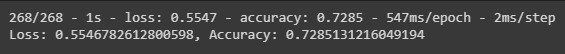
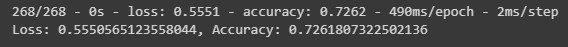
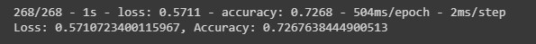

# Alphabet Soup Charity Evaluation: Neural Network Model Report
<image> </image>

## Overview

This is a report on the usage of a neural network model of machine learning and the attempt to determine if a charity will be successful if provided funding by Alphabet Soup. This report is broken into 3 sections: 

|Section|Description|
|-------|-----------|
|Overview| The current section, which aims to provide context for this report.|
|Results| This section aims to explain the process of building the Neural Network model over two sub-sections, Data Preprocessing and Compiling, Traning, and Evaluating.|
|Summary| A summation of the key points from the results and closing remarks on project viability and future recommendations.|

---

## Results

This section is broken into two main points: Data Preprocessing, and Compiling, Training and Evaluation.

### **Data Preprocessing**

In this section, this report will break down the data I determined for use in the model. 

> **Question:** What variables does this model seek to target?

For this project only 1 target variable was used to build a given model. This chosen variable `y` was the success of a charity as provided in the dataset as `IS_SUCCESSFUL`. This variable is what this project aimed to predict, and is represented by a value of 0 or 1 as the state of success.

> **Question**: What variables does this model use as features? 

For this project, 9 variables are considered as features. They are:

- APPLICATION_TYPE
- CLASSIFICATION
- USE_CASE
- ORGANIZATION
- STATUS
- INCOME_AMT
- SPECIAL_CONSIDERATIONS
- ASK_AMT

As these 8 variables are not all formatted numerically, they are converted. Following this conversion we are left with our feasutres,X, as 44 columns derived from the original 8. 

> **Question:** Do any variables need to be removed from the dataset? 

Yes. 2 variables needed to be removed from the dataset. These two are as follows:

- EIN
- NAME

They were removed as they offer no value for the model, as they only serve as identification of the charities whose data is being used for this model.

**### Compiling, Training, and Evaluating the Model**

This section explains the build of the model, the success of the model, and further steps taken to improve the model

> Question: How many neurons, layers, and activation functions were chosen for the Neural Network model? Why?

- 44 neurons were used for the input layer.

44 neurons were chosen as that is the amount of features in the model.

- 2 hidden layers were used. The amount of neurons they used were as follows:
  - First layer: 22
  - Second layer: 11

These values were derived from the amount of neurons in the input layer. The first layer used half as many neurons of the input layer, and the second layer used half of the first layer. 

- 1 neuron was used in the output layer

A single neuron was chosen due to only having a binary target variable, 0 or 1. This model only needs 1 neuron for the output.

> **Question:** Were you able to achieve the targert model performance?

No. Ultimately the model was only able to reach an accuracy of 72.75%. Further adjustments to the moddeling process must be taken to attempt to increase accuracy.

> **Question:** What steps did you take in your attempts to increase model performance?

Six attempts were made to optimize and improve model performance, for a total of Seven attempts. They are as follows:

**Attempt 1** The original attempt on initially preprocessed dataset. 
   - 44 neurons for input
   - 2 hidden layers
      - First layer: 22 neurons, ReLU activation function 
      - Second Layer: 11 neurons, ReLU activation function 
   - 1 neuron for output
   - 100 Epochs

---

Attempts 2 onward utilized an adjusted preprocessing to the `CLASSIFICATION` variables, previously classifications that accounted for less than 1% of the overall classifcations were all 
put into a group called 'other'. Attempts 2 onward changed the exclusion cut off point to be classifications with less than a count of 100, grouping those who were less than 100 in the 'other' group.

**Attempt 2** - Adjusted for new cut off, which introduced 4 new features from `CLASSIFICATIONS`. 
   - 49 neurons for input
   - 2 hidden layers
      - First layer: 36 neurons, ReLU activation function 
      - Second Layer: 26 neurons, ReLU activation function 
   - 1 neuron for output
   - 100 Epochs

---

**Attempt 3** - Utilizing different activation function
    - 49 neurons for input
   - 2 hidden layers
      - First layer: 36 neurons, ELU activation function 
      - Second Layer: 26 neurons, ELU activation function 
   - 1 neuron for output
   - 100 Epochs

---

**Attempt 4** - Return to using ReLU activation function, increasing the epoch count
   - 49 neurons for input
   - 2 hidden layers
      - First layer: 36 neurons, ReLU activation function 
      - Second Layer: 26 neurons, ReLU activation function 
   - 1 neuron for output
   - 200 Epochs

---

**Attmept 5** - Adjust the hidden layers, continue using 200 epochs
   - 49 neurons for input
   - 2 hidden layers
      - First layer: 40 neurons, ReLU activation function 
      - Second Layer: 30 neurons, ReLU activation function 
   - 1 neuron for output
   - 200 Epochs

---

**Attempt 6** - Continue using adjusted hidden layers, increase epoch count
   - 49 neurons for input
   - 2 hidden layers
      - First layer: 40 neurons, ReLU activation function 
      - Second Layer: 30 neurons, ReLU activation function 
   - 1 neuron for output
   - 500 Epochs

---

**Attempt 7** - Final attempt. Reduce epochs back to 200. Add hidden layer. 
   - 49 neurons for input
   - 3 hidden layers
      - First layer: 40 neurons, ReLU activation function 
      - Second Layer: 30 neurons, ReLU activation function 
      - Third layer: 20 neurons, ReLU activation function
   - 1 neuron for output
   - 200 Epochs

--- 

## Summary

Ultimately, I believe the preprocessing portion of building this model was erred and could be improved to provide stronger performance for the neural network model. Further, utilizing the Keras Tuner library to optimize hyperparameters could be useful for future improvements. For future machine learning modeling, I would suggest utilizing a KMeans model in order to first determine if the features in this dataset have relatability to one another in order to determine if chasing a predictable outcome is worth the investment of time/energy.  